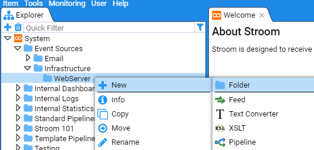
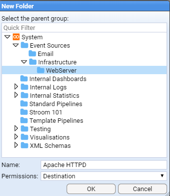
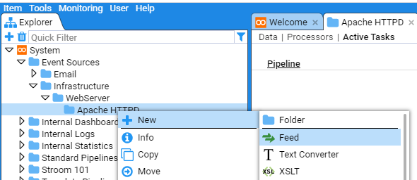
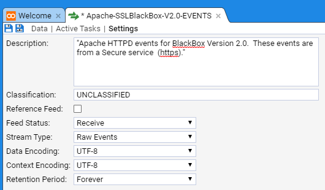
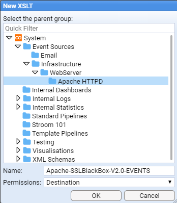
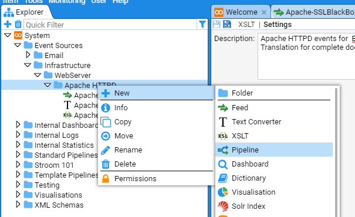
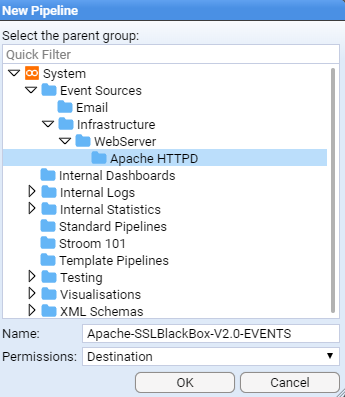
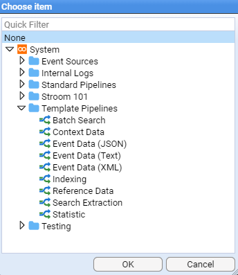
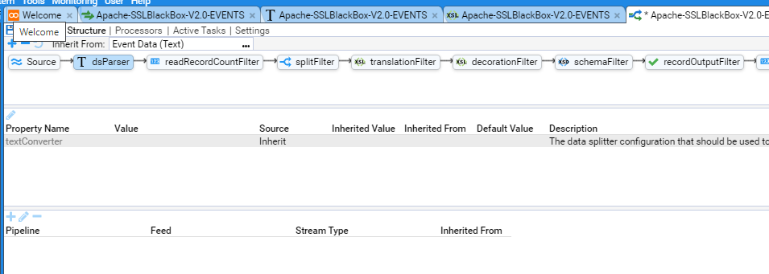

# **HOWTO - Apache HTTPD Event Feed**

The following will take you though the process of creating an Event Feed in Stroom.

In this example, the logs are in a well defined, line based, text format so we will use a Data Splitter parser to transform the logs into simple record based XML and then a XSLT translation to normalise them into the Event schema.

A separate document will describe the method of automating the storage of normalised events for this feed. Further, we will not Decorate these events. Again, Event Decoration is described in another document.

Author: John Doe
Last Updated: 7 Mar 2020
Recommended Additional Documentation: 
HOWTO - Enabling Processors for a Pipeline

Event Log Source

For this example, we will use logs from an Apache HTTPD Web server. In fact, the web server in front of Stroom.

To get the optimal information from the Apache HTTPD access logs, we define our log format based on an extension the the BlackBox format. The format is described and defined below. This is an extract from a httpd configuration file (/etc/httpd/conf/httpd.conf)

```
#  Stroom - Black  Box  Auditing configuration
#
#  %a  - Client  IP address  (not  hostname (%h) to ensure ip address only)
#  When  logging the remote host,  it is important to log the client  IP address, not the
#  hostname. We do   this  with the '%a' directive.  Even  if HostnameLookups  are turned on,
#  using '%a' will  only record the IP address.  For the purposes of BlackBox formats,
#  reversed DNS should not  be trusted

#  %{REMOTE_PORT}e  - Client source port
#  Logging the client  source TCP  port  can provide some   useful  network data and can help
#  one associate a single client  with multiple requests.
#  If two   clients from the  same IP address  make   simultaneous connections, the 'common  log'
#  file format cannot distinguish  between those  clients. Otherwise, if  the client uses
#  keep-alives, then every hit  made   from a single  TCP  session will  be associated  by   the  same
#  client  port number.
#  The   port information can indicate  how  many   connections our server is  handling at  once,
#  which may  help in tuning server TCP/OP   settings. It will also identify which client ports
#  are legitimate requests if  the administrator is examining a possible  SYN-attack against  a
#  server.
#  Note we  are using the REMOTE_PORT  environment variable. Environment variables  only come
#  into play when   mod_cgi or  mod_cgid is  handling the request.

#  %X   - Connection status  (use %c  for  Apache 1.3)
#  The   connection status  directive  tells us detailed  information about the client  connection.
#  It returns  one of three flags:
#  x  if the client aborted the connection before completion,
#  +  if  the client has indicated that it will  use keep-alives (and request additional  URLS),
#  - if the connection will  be closed after  the event
#  Keep-Alive is a HTTP 1.1.  directive  that  informs a web  server that  a client  can request multiple
#  files during the  same connection.  This way  a client  doesn't need to go   through the  overhead
#  of re-establishing  a TCP  connection to retrieve  a new  file.

#  %t  - time - or  [%{%d/%b/%Y:%T}t.%{msec_frac}t %{%z}t] for  Apache 2.4
#  The   %t  directive  records the time that  the request started.
#  NOTE:  When  deployed on   an  Apache 2.4, or better,  environment, you   should use
#  strftime  format in  order  to  get  microsecond resolution.

#  %l  - remote logname

#  %u - username [in quotes]
#  The   remote user  (from auth;  This may  be bogus if the return status  (%s) is  401
#  for non-ssl services)
#  For SSL  services,  user names need to  be delivered  as DNs  to deliver PKI   user details
#  in full.  To  pass through PKI   certificate  properties in the correct form you   need to
#  add the following directives  to your  Apache configuration:
# 	SSLUserName   SSL_CLIENT_S_DN
# 	SSLOptions +StdEnvVars
#  If you   cannot,  then use %{SSL_CLIENT_S_DN}x   in place of %u and use  blackboxSSLUser
#  LogFormat nickname

#  %r  - first  line of text sent by   web  client [in quotes]
#  This is the first  line of text send by   the web  client, which includes the request
#  method, the  full URL,  and the  HTTP protocol.

#  %s  - status  code before any redirection
#  This is  the status  code of the original request.

#  %>s  - status  code after  any redirection  has taken place
 
#  This is  the final  status  code of the request, after  any internal  redirections  may
#  have taken  place.

#  %D   - time in  microseconds to handle the request
#  This is the  number of microseconds the  server  took to  handle the  request  in  microseconds

#  %I  - incoming bytes
#  This is  the bytes received, include request and headers. It  cannot, by   definition be zero.

#  %O   - outgoing bytes
#  This is  the size in bytes of the outgoing data,  including HTTP headers. It  cannot,  by
#  definition be zero.

#  %B  - outgoing content bytes
#  This is  the size in bytes of the outgoing data,  EXCLUDING  HTTP headers.  Unlike %b,   which
#  records '-' for zero bytes transferred,  %B  will record '0'.

#  %{Referer}i - Referrer HTTP Request  Header [in quotes]
#  This is  typically the URL of the page that  made   the request.  If  linked from
#  e-mail or direct  entry this  value will be empty. Note, this  can be spoofed
#  or turned off

#  %{User-Agent}i - User agent HTTP Request  Header [in quotes]
#  This is  the identifying information the client  (browser) reports about itself.
#  It can be spoofed or  turned  off

#  %V   - the server name   according to the UseCannonicalName setting
#  This identifies  the virtual  host in a multi host webservice

#  %p - the canonical port of the server servicing the request

#  Define a variation  of the Black Box  logs
#
#  Note, you   only need to  use the  'blackboxSSLUser' nickname if you   cannot set  the
#  following directives  for any SSL  configurations
#  SSLUserName   SSL_CLIENT_S_DN
#  SSLOptions +StdEnvVars
#  You  will also note the variation for no   logio  module. The   logio  module supports
#  the %I  and %O   formatting directive
#
<IfModule mod_logio.c>
LogFormat "%a/%{REMOTE_PORT}e  %X   %t  %l  \"../../"%r\" %s/%>s   %D   %I/%O/%B  \"%{Referer}i\"  \"%{User-Agent}i\" %V/%p"  blackboxUser
LogFormat "%a/%{REMOTE_PORT}e  %X   %t  %l  \"%{SSL_CLIENT_S_DN../../"%r\" %s/%>s   %D   %I/%O/%B  \"%{Referer}i\"  \"%{User-Agent}i\" %V/%p"  blackboxSSLUser
</IfModule>
<IfModule !mod_logio.c>
LogFormat "%a/%{REMOTE_PORT}e  %X   %t  %l  \"../../"%r\" %s/%>s   %D   0/0/%B  \"%{Referer}i\"  \"%{User-Agent}i\" %V/$p"  blackboxUser
LogFormat "%a/%{REMOTE_PORT}e  %X   %t  %l  \"%{SSL_CLIENT_S_DN../../"%r\" %s/%>s   %D   0/0/%B  \"%{Referer}i\"  \"%{User-Agent}i\" %V/$p"  blackboxSSLUser
</IfModule>
```

A copy of this sample data source can be found [here](ApacheHTTPDAuditConfig.txt "Apache BlackBox Auditing Configuration"). Save a copy of this data to your local environment for use later in this HowTo.

As Stroom can use PKI for login, you can configure Stroom’s Apache to make use of the blackboxSSLUser log format. A sample set of logs in this format appear below.

```
192.168.4.220/61801 - [18/Jan/2020:12:39:04 -800] - "/C=USA/ST=CA/L=Los Angeles/O=Default Company Ltd/CN=Burn Frank (burn)" "POST /accounting/ui/dispatch.rpc HTTP/1.1" 200/200 21221 2289/415/14 "https://host01.company4.org/accounting/" "Mozilla/5.0 (Windows NT 6.3; WOW64) AppleWebKit/537.36 (KHTML, like Gecko) Chrome/39.0.2171.99 Safari/537.36" host01.company4.org/443
192.168.4.220/61854 - [18/Jan/2020:12:40:04 -800] - "/C=USA/ST=CA/L=Los Angeles/O=Default Company Ltd/CN=Burn Frank (burn)" "POST /accounting/ui/dispatch.rpc HTTP/1.1" 200/200 7889 2289/415/14 "https://host01.company4.org/accounting/" "Mozilla/5.0 (Windows NT 6.3; WOW64) AppleWebKit/537.36 (KHTML, like Gecko) Chrome/39.0.2171.99 Safari/537.36" host01.company4.org/443
192.168.4.220/61909 - [18/Jan/2020:12:41:04 -800] - "/C=USA/ST=CA/L=Los Angeles/O=Default Company Ltd/CN=Burn Frank (burn)" "POST /accounting/ui/dispatch.rpc HTTP/1.1" 200/200 6901 2389/3796/14 "https://host01.company4.org/accounting/" "Mozilla/5.0 (Windows NT 6.3; WOW64) AppleWebKit/537.36 (KHTML, like Gecko) Chrome/39.0.2171.99 Safari/537.36" host01.company4.org/443
192.168.4.220/61962 - [18/Jan/202015:12:42:04 -800] - "/C=USA/ST=CA/L=Los Angeles/O=Default Company Ltd/CN=Burn Frank (burn)" "POST /accounting/ui/dispatch.rpc HTTP/1.1" 200/200 11219 2289/415/14 "https://host01.company4.org/accounting/" "Mozilla/5.0 (Windows NT 6.3; WOW64) AppleWebKit/537.36 (KHTML, like Gecko) Chrome/39.0.2171.99 Safari/537.36" host01.company4.org/443
192.168.3.117/62015 - [18/Jan/2020:12:43:04 -1000] - "/C=AUS/ST=NSW/L=Sydney/O=Default Company Ltd/CN=Max Bergman (maxb)" "POST /accounting/ui/dispatch.rpc HTTP/1.1" 200/200 4265 2289/415/14 "https://stroomnode01.strmdev01.org/accounting/" "Mozilla/5.0 (Windows NT 6.3; WOW64) AppleWebKit/537.36 (KHTML, like Gecko) Chrome/39.0.2171.99 Safari/537.36" stroomnode01.strmdev01.org/443
192.168.3.117/62092 - [18/Jan/2020:12:44:04 -1000] - "/C=AUS/ST=NSW/L=Sydney/O=Default Company Ltd/CN=Max Bergman (maxb)" "POST /accounting/ui/dispatch.rpc HTTP/1.1" 200/200 9791 2289/415/14 "https://stroomnode01.strmdev01.org/accounting/" "Mozilla/5.0 (Windows NT 6.3; WOW64) AppleWebKit/537.36 (KHTML, like Gecko) Chrome/39.0.2171.99 Safari/537.36" stroomnode01.strmdev01.org/443
192.168.3.117/62147 - [18/Jan/2020:12:44:04 -1000] - "/C=AUS/ST=NSW/L=Sydney/O=Default Company Ltd/CN=Max Bergman (maxb)" "POST /accounting/ui/dispatch.rpc HTTP/1.1" 200/200 11509 2289/415/14 "https://stroomnode01.strmdev01.org/accounting/" "Mozilla/5.0 (Windows NT 6.3; WOW64) AppleWebKit/537.36 (KHTML, like Gecko) Chrome/39.0.2171.99 Safari/537.36" stroomnode01.strmdev01.org/443
192.168.3.117/62202 - [18/Jan/2020:12:44:04 -1000] - "/C=AUS/ST=NSW/L=Sydney/O=Default Company Ltd/CN=Max Bergman (maxb)" "POST /accounting/ui/dispatch.rpc HTTP/1.1" 200/200 4627 2389/3796/14 "https://stroomnode01.strmdev01.org/accounting/" "Mozilla/5.0 (Windows NT 6.3; WOW64) AppleWebKit/537.36 (KHTML, like Gecko) Chrome/39.0.2171.99 Safari/537.36" stroomnode01.strmdev01.org/443
192.168.3.117/62294 - [18/Jan/2020:12:44:04 -1000] - "/C=AUS/ST=NSW/L=Sydney/O=Default Company Ltd/CN=Max Bergman (maxb)" "POST /accounting/ui/dispatch.rpc HTTP/1.1" 200/200 12367 2289/415/14 "https://stroomnode01.strmdev01.org/accounting/" "Mozilla/5.0 (Windows NT 6.3; WOW64) AppleWebKit/537.36 (KHTML, like Gecko) Chrome/39.0.2171.99 Safari/537.36" stroomnode01.strmdev01.org/443
192.168.3.117/62349 - [18/Jan/2020:12:44:04 -1000] - "/C=AUS/ST=NSW/L=Sydney/O=Default Company Ltd/CN=Max Bergman (maxb)" "POST /accounting/ui/dispatch.rpc HTTP/1.1" 200/200 12765 2289/415/14 "https://stroomnode01.strmdev01.org/accounting/" "Mozilla/5.0 (Windows NT 6.3; WOW64) AppleWebKit/537.36 (KHTML, like Gecko) Chrome/39.0.2171.99 Safari/537.36" stroomnode01.strmdev01.org/443
192.168.2.245/62429 - [18/Jan/2020:12:50:04 +200] - "/C=GBR/ST=GLOUCESTERSHIRE/L=Bristol/O=Default Company Ltd/CN=Kostas Kosta (kk)" "POST /accounting/ui/dispatch.rpc HTTP/1.1" 200/200 12245 2289/415/14 "https://stroomnode00.strmdev01.org/accounting/" "Mozilla/5.0 (Windows NT 6.3; WOW64) AppleWebKit/537.36 (KHTML, like Gecko) Chrome/39.0.2171.99 Safari/537.36" stroomnode00.strmdev01.org/443
192.168.2.245/62495 - [18/Jan/2020:12:51:04 +200] - "/C=GBR/ST=GLOUCESTERSHIRE/L=Bristol/O=Default Company Ltd/CN=Kostas Kosta (kk)" "POST /accounting/ui/dispatch.rpc HTTP/1.1" 200/200 4327 2289/415/14 "https://stroomnode00.strmdev01.org/accounting/" "Mozilla/5.0 (Windows NT 6.3; WOW64) AppleWebKit/537.36 (KHTML, like Gecko) Chrome/39.0.2171.99 Safari/537.36" stroomnode00.strmdev01.org/443
192.168.2.245/62549 - [18/Jan/2020:12:52:04 +200] - "/C=GBR/ST=GLOUCESTERSHIRE/L=Bristol/O=Default Company Ltd/CN=Kostas Kosta (kk)" "POST /accounting/ui/dispatch.rpc HTTP/1.1" 200/200 7148 2289/415/14 "https://stroomnode00.strmdev01.org/accounting/" "Mozilla/5.0 (Windows NT 6.3; WOW64) AppleWebKit/537.36 (KHTML, like Gecko) Chrome/39.0.2171.99 Safari/537.36" stroomnode00.strmdev01.org/443
192.168.2.245/62626 - [18/Jan/2020:12:52:04 +200] - "/C=GBR/ST=GLOUCESTERSHIRE/L=Bristol/O=Default Company Ltd/CN=Kostas Kosta (kk)" "POST /accounting/ui/dispatch.rpc HTTP/1.1" 200/200 11386 2289/415/14 "https://stroomnode00.strmdev01.org/accounting/" "Mozilla/5.0 (Windows NT 6.3; WOW64) AppleWebKit/537.36 (KHTML, like Gecko) Chrome/39.0.2171.99 Safari/537.36" stroomnode00.strmdev01.org/443
```

A copy of this sample data source can be found [here](sampleApacheBlackBox.log "Apache BlackBox sample log"). Save a copy of this data to your local environment for use later in this HowTo.

## **Create the Feed and it’s Pipeline**

To reflect the source of these Accounting Logs, we will name our feed and it’s pipeline Apache-SSLBlackBox-V2.0-EVENTS and it will be stored in the system group
Apache  HTTPD under the main system group - Feeds  and Translations.

### **Create System Group**

To create the system group Apache  HTTPD, navigate to the _Event Sources/Infrastructure/WebServer_ system group within the Explorer pane (if this system group structure does not already exist in your Stroom instance then refer to the **HOWTO Stroom Explorer Management** for guidance). Left click to highlight the
_WebServer_ system group then right click to bring up the object context menu. Navigate to the _New_ icon, then the _Folder_ icon to reveal the _New Folder_ selection window.



In the New Folder window enter Apache HTTPD into the **Name:** text entry box.



The click on **OK** at which point you will be presented with the Apache HTTPD system group configuration tab. Also note, the _WebServer_ system group within the Explorer pane has automatically expanded to display the `Apache HTTPD` system group.


Close the Apache HTTPD system group configuration tab by clicking on the close item icon on the right hand side of the tab . We now need to create, in order
- the Feed,
- the Text Parser,
- the Translation and finally,
- the Pipeline.

### **Create Feed**

Within the Explorer pane, and having selected the Apache HTTPD group, right click to bring up object context menu. Navigate to New, Feed



Select the Feed icon , when the **New Feed** selection window comes up, ensure the `Apache HTTPD` system group is selected or navigate to it. Then enter the name of the feed, Apache-SSLBlackBox-V2.0-EVENTS, into the **Name:** text entry box the press **OK**. 

It should be noted that the default Stroom FeedName pattern will not accept this name. One needs to modify the `stroom.feedNamePattern` stroom property to change the default pattern to `^[a-zA-Z0-9_-\.]{4,}$`. See the [HOWTO on System Properties](../Administration/SystemProperties.md "System Properties") docment to see how to make this change.


At this point you will be presented with the new feed's configuration tab and the feed's Explorer object will automatically appear in the Explorer pane within the `Apache HTTPD` system group.

Select the _Settings_ tab on the feed's configuration tab.
Enter an appropriate description into the **Description:** text entry box, for instance:

"Apache HTTPD events for BlackBox Version 2.0.  These events are from a Secure service  (https)."

In the **Classification:** text entry box, enter a Classification of the data that the event feed will contain - that is the classification or sensitivity of the accounting log’s content itself.

As this is not a Reference Feed, leave the **Reference Feed:** check box unchecked. 

We leave the **Feed Status:** at _Receive_.

We leave the **Stream Type:** as _Raw Events_ as this we will be sending batches (streams) of raw event logs.

We leave the **Data Encoding:** as UTF-8 as the raw logs are in this form.

We leave the **Context Encoding:** as UTF-8 as there no context events for this feed. 

We leave the **Retention Period:** at _Forever_ as we do not want to delete the raw logs.

This results in



Save the feed by clicking on the  icon.

### **Create Text Converter**

Within the Explorer pane, and having selected the `Apache HTTPD` system group, right click to bring up object context menu, then navigate to the  icon to reveal the New sub-context menu. Next, navigate to the   Text Converter item


and left click to select. When the **New Text Converter** 


selection window comes up enter the name of the feed, Apache-SSLBlackBox-V2.0-EVENTS, into the **Name:** text entry box then press **OK**. At this point you will be presented with the new text converter's configuration tab.


Enter an appropriate description into the **Description:** text entry box, for instance

"Apache HTTPD events for BlackBox Version 2.0 - text converter. See Conversion for complete documentation."

Set the **Converter Type:** to be Data Splitter from drop down menu.


Save the text converter by clicking on the  icon.

### **Create XSLT Translation**

Within the Explorer pane, and having selected the `Apache HTTPD` system group, right click to bring up object context menu, then navigate to the 	New icon to reveal the New sub-context menu. Next, navigate to the  item and left click to select.


When the **New XSLT** selection window comes up,



 enter the name of the feed, Apache-SSLBlackBox-V2.0-EVENTS, into the **Name:** text entry box then press **OK**. At this point you will be presented with the new XSLT's configuration tab.

 

 Enter an appropriate description into the **Description:** text entry box, for instance

"Apache HTTPD events for  BlackBox Version 2.0  - translation. See Translation for complete documentation."


Save the XSLT by clicking on the  icon.

### **Create Pipeline**

Within the Explorer pane, and having selected the Apache HTTPD system group, right click to bring up object context menu, then the New sub-context menu. Navigate to the   Pipeline and left click to select. When the **New Pipeline**



selection window comes up, navigate to, then select the Apache HTTPD system group and then enter the name of the pipeline, Apache-SSLBlackBox-V2.0-EVENTS
into the **Name:** text entry box then press **OK**. At this you will be presented with the new pipeline’s configuration tab



As usual, enter an appropriate **Description:**

"Apache HTTPD events for BlackBox Version 2.0  - pipeline. This pipeline uses the standard event pipeline to store the events in the Event Store."


Save the pipeline by clicking on the  icon.

We now need to select the structure this pipeline will use. We need to move from the **Settings** sub-item on the pipeline configuration tab to the **Structure** sub-item. This is done by clicking on the **Structure** link, at which we see


Next we will choose an Event Data pipeline. This is done by inheriting it from a defined set of Template Pipelines. To do this, click on the menu selection icon  to the right of the Inherit From: text display box.

When the **Choose item**



selection window appears, select from the `Template Pipelines` system group. In this instance, as our input data is text, we select (left click) the 

 Event Data (Text) pipeline


then press **OK**. At this we see the inherited pipeline structure of


We now need to associate our Text Converter and Translation with the pipeline so that we can pass raw events (logs) through our pipeline in order to save them in the Event Store.

To associate the Text Converter, select the Text Converter icon, to display.



Now identify to the **Property** pane (the middle pane of the pipeline configuration tab), then and double click on the _textConverter_ Property Name to display the **Edit
Property** selection window that allows you to edit the given property


