# Stroom HOWTO - Enabling Processors for a Pipeline

### Document Properties

* Author: John Doe 
* Last Updated: 8 May 2020
* Recommended Additional Documentation:
HOWTO - Creating a Simple Reference Feed
* Version Information: Created with Stroom v6

## Introduction

A pipeline is a structure that allows for the processing of streams of data.
Once you have defined a pipeline, built its structure, and tested it via 'Stepping' the pipeline, you will want to enable the automatic processing of raw event data streams.
In this example we will build on our `Apache-SSLBlackBox-V2.0-EVENTS` event feed and enable automatic processing of raw event data streams. \
If this is the first time you have set up pipeline processing on your Stroom instance you may need to check that the **Stream Processor** job is enabled on your Stroom instance. Refer to the Stream Processor Tasks section of the Stroom HOWTO - Task Maintenance
documentation for detailed instruction on this.

## Pipeline

Initially we need to open the `Apache-SSLBlackBox-V2.0-EVENTS` pipeline. Within the Explorer pane, navigate to the Apache HTTPD folder, then double click on the  object to bring up the `Apache-SSLBlackBox-V2.0-EVENTS` pipeline configuration tab

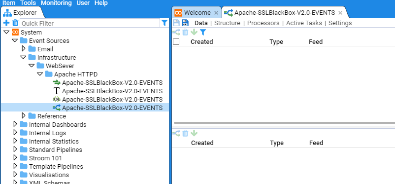

Next, select the **Processors** sub-item to show

This configuration tab is divided into two panes. The top pane shows the current enabled Processors and any recently processed streams and the bottom pane provides meta-data about each Processor or recently processed streams.

### Add a Processor

We now want to add A Processor for the `Apache-SSLBlackBox-V2.0-EVENTS` pipeline.

First, move the mouse to the Add Processor   icon at the top left of the top pane. Select by left clicking this icon to display the **Add Filter** selection window

This selection window allows us to _filter_ what set of data streams we want our Processor to process. As our intent is to enable processing for all Apache-SSLBlackBox-V2.0-EVENT streams, both already received and yet to be received, then our filtering criteria is just to process all Raw Events streams for this feed, ignoring all other conditions.

To do this, first click on the **Add Term**  icon. Keep the term and operator at the default settings, and select the **Choose item**   icon to navigate to the desired feed name (Apache-SSLBlackBox-V2.0-EVENT) object

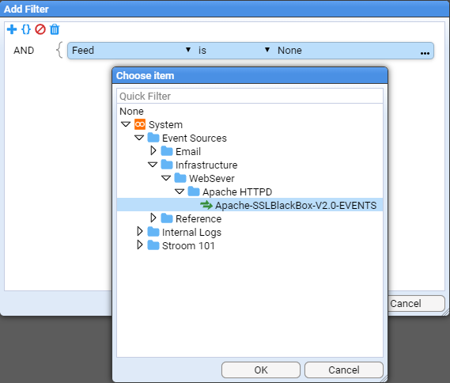

and press **OK** to make the selection.

Next, we select the required _stream type_. To do this click on the **Add Term**  icon again. Click on the down arrow to change the Term selection from _Feed_ to _Type_. Click in the **Value** position on the highlighted line (it will be currently empty). Once you have clicked here a drop-down box will appear as per

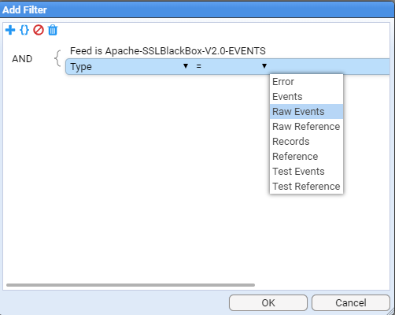

at which point, select the _Stream Type_ of **Raw Events** and then press **OK**. At this we return to the **Add Processor** selection window to see that the _Raw Events_ stream type has been added.

If the expected feed rate is small, for example, _NOT_ operating system or database access feeds, then you would leave the Processor **Priority** at the default of _10_. Typically, Apache HTTPD access events are not considered to have an excessive feed rate (by comparison to operating system or database access feeds), so we leave the **Priority** at _10_.

Note the Processor has been added but it is in a **disabled** state. We **enable** both pipeline processor and the processor filter by checking _both_ **Enabled** check boxes

Once the processor has been enabled, at first you will see nothing. But if you press the  button at the top of the right of the top pane, you will see that the _Child_ processor has processed a stream, listing the time it did it and also listing the last time the processor looked for more streams to process and how many it found. 
If your event feed contained multiple streams you would see the streams count incrementing and the **Tracker%** incrementing (when the Tracker% reaches 100% then all current streams you filtered for have been processed). You may need to click on the refresh  icon to see the stream count and Tracker% changes.

When in the **Processors** sub-item, if we select the Parent Processor, then no meta-data is displayed

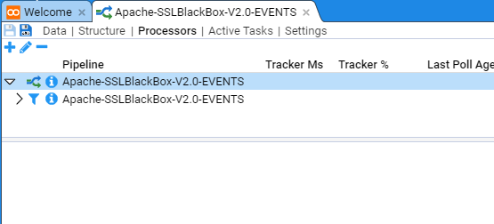

If we select the Parent's child, then we see the meta-data for this, the actual actionable Processor

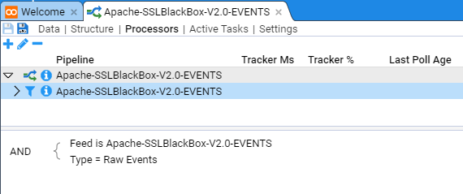

If you select the **Active Tasks** sub-item, you will see a summary of the recently processed streams

The top pane provides a summary table of recent stream batches processed, based on Pipeline and Feed, and if selected, the individual streams will be displayed in the bottom pane

If further detail is required, then left click on the  icon at the top left of a pane. This will reveal additional information such as

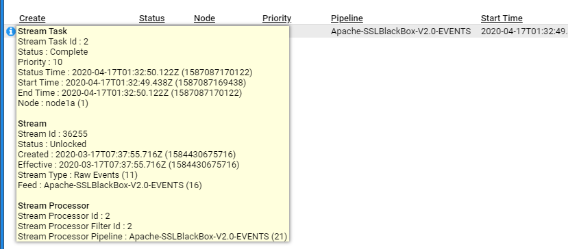

At this point, if you click on the **Data** sub-item you will see

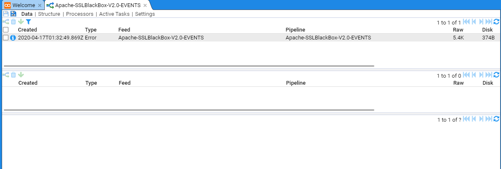

This view displays the recently processed streams in the top pane. If a stream is selected, then the _Specific_ stream and any related streams are displayed in the middle pane and the bottom pane displays the data itself

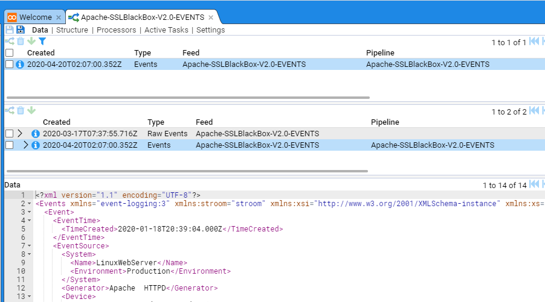

As you can see, the processed stream has an associated _Raw Events_ stream. If we click on that stream we will see the raw data

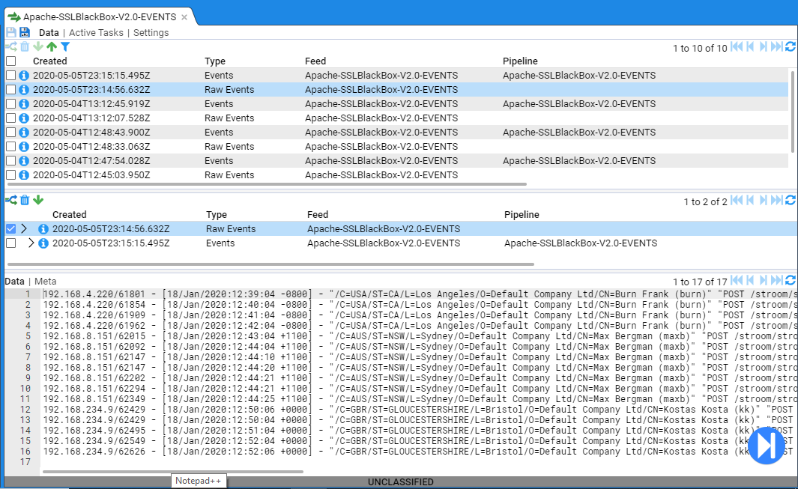

### Processor Errors

Occasionally you may need to reprocess a stream.
This is most likely required as a result of correcting translation issues during the development phase, or it can occur from the data source having an unexpected change (unnotified application upgrade for example).
You can reprocess a stream by selecting its check box and then pressing the  icon in the top left of the same pane. This will cause the pipeline to reprocess the selected stream. One can only reprocess _Event_ or _Error_ streams.

In the below example we have a stream that is displaying errors (this was due to a translation that did not conform to the schema version).

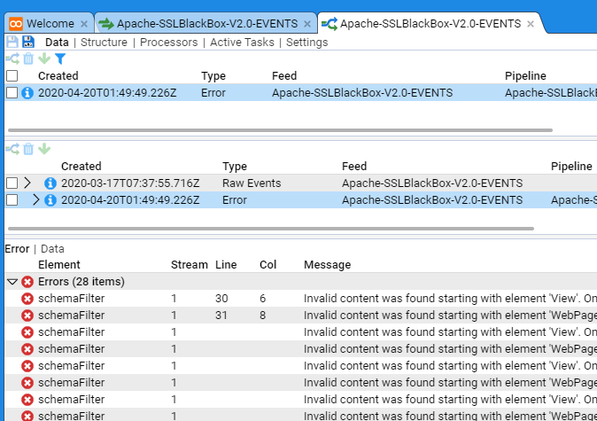

Once the translation was remediated to remove schema issues the pipeline could successfully process the stream and the errors disappeared.

You should be aware that if you need to reprocess bulk streams that there is an upper limit of 1000 streams that can be reprocessed in a single batch. As at Stroom v6 if you exceed this number then you receive no error notification but the task never completes.
The reason for this behaviour is to do with database performance and complexity. When you reprocess the current selection of filtered data, it can contain data that has resulted from many pipelines and this requires creation of new processor filters for each of these pipelines. Due to this complexity there exists an arbitrary limit of 1000 streams. 

A workaround for this limitation is to create batches of 'Events' by filtering the event streams based on **Type** and **Create Time**. 

For example in our `Apache-SSLBlackBox-V2.0-EVENTS` event feed select the  icon.

Filter the feed by errors and creation time. Then click **OK**.

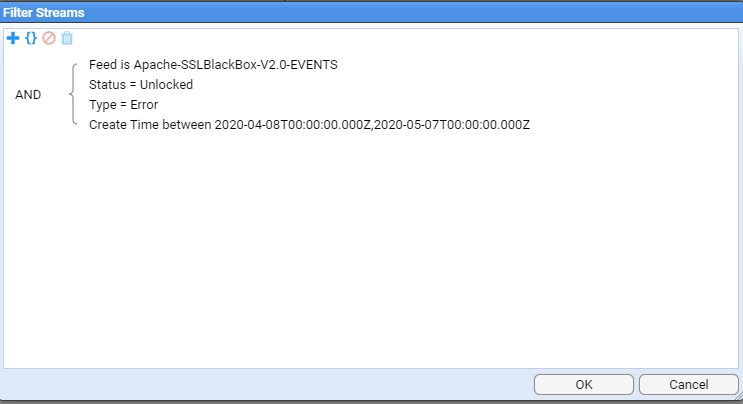

You will need to adjust the  create time range until you get the number of event streams displayed in the feed window below 1000.

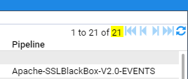

Once you are displaying less than 1000 streams you can select all the streams in your filtered selection by clicking in the topmost selection box . Then click on the  icon to reprocess these streams.

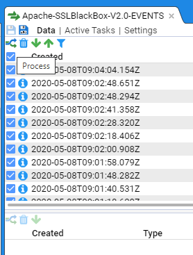. 

Repeat the process in batches of less that 1000 until your entire error stream backlog has been reprocessed.

In a worst case senario, one can also delete a set of streams for a given time period and then reprocess them all. The only risk here is that if there
are other pipelines that trigger on Event creation, you will activate them. 

The reprocessing may result in having two index entries in an index. Stroom dashboards can silently cater for this, or you may chose to re-flatten data to some external downstream capability.

When considering reprocessing streams there are some other 'downstream effects' to be mindful of.

If you have indexing in place, then additional index documents will be added to the index as the indexing capability does not replace documents, but adds them. If there are only a small number of streams reprocessed then there should not be too big an index storage impost, but should a large number of streams be reprocessed, then consideration of rebuilding resultant indices may need to be considered.

If the pipeline exports data for consumption by another capability, then you will have exported a portion of the data twice. Depending on the risk of downstream data duplication, you may need to prevent the export or the consumption of the export. Some ways to address this can vary from creating a new pipeline to reprocess the errant streams which does not export data, to temporarily redirecting the export destination whilst reprocessing and preventing ingest of new source data to the pipeline at the same time.